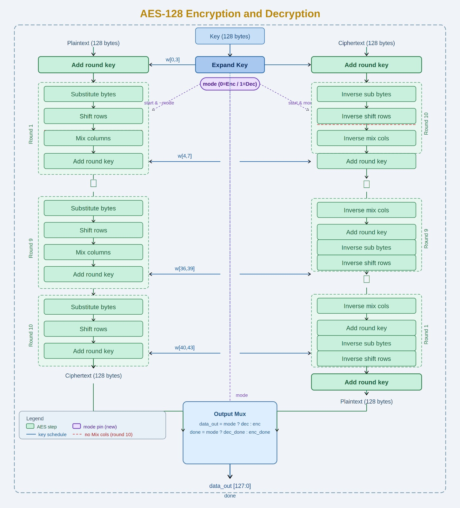
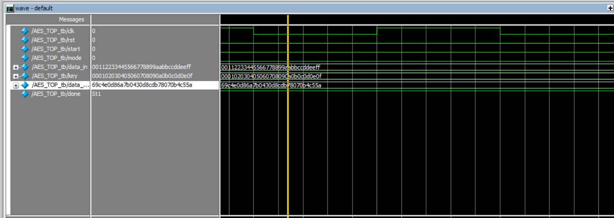
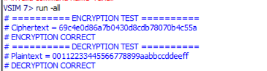

# Encryption-Decryption-AES-128

## Overview

This project implements AES-128 encryption and decryption in Verilog HDL.

The design supports both encryption and decryption modes through a top-level controller and has been verified using standard AES-128 test vectors.

## Architecture

## Encryption Waveform

## Simulation Output

## Features

* AES-128 Encryption
* AES-128 Decryption
* Key Expansion
* Encryption Mode Verification
* Decryption Mode Verification
* Verilog HDL Implementation

## Test Vector

Plaintext:
00112233445566778899aabbccddeeff

Key:
000102030405060708090a0b0c0d0e0f

Ciphertext:
69c4e0d86a7b0430d8cdb78070b4c55a

## Tools Used

* Verilog HDL
* ModelSim
* Intel Quartus Prime
